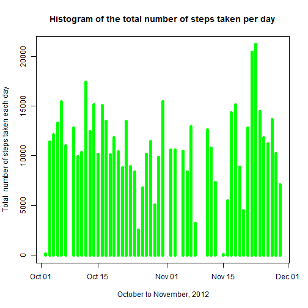
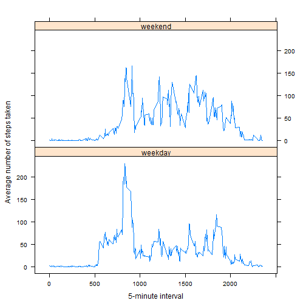

{r setup, include=FALSE}  
knitr::opts_chunk$set(echo = TRUE) 

---
title: "Reproducible Research: Peer Assessment 1"  
output: 
  html_document:  
    keep_md: true  
--- 


```r
    library(ggplot2)
    library(lattice)
    setwd("D:/CoursERA/Course5/Assignment1")
```
#### Loading and preprocessing the data

```r
    unzip(zipfile="./activity.zip", overwrite = TRUE)
    activity      <- read.csv(file = './activity.csv', stringsAsFactors = FALSE)
    activity$date <- as.Date(activity$date,'%Y-%m-%d')
    activityCC    <- subset(activity, complete.cases(activity))
```
#### What is mean total number of steps taken per day?

1. Total number of steps taken per day:

```r
    dailyTotSteps<-aggregate(formula = steps~date, data = activity, 
                             FUN =   sum,na.rm=TRUE)
    head(dailyTotSteps)
```

```
##         date steps
## 1 2012-10-02   126
## 2 2012-10-03 11352
## 3 2012-10-04 12116
## 4 2012-10-05 13294
## 5 2012-10-06 15420
## 6 2012-10-07 11015
```
2. Histogram of the total number of steps taken each day

```r
    plot(dailyTotSteps$date,dailyTotSteps$steps,type="h", 
    main = "Histogram of the total number of steps taken per day",
    ylab="Total  number of steps day", xlab=" October to November, 2012", 
    lwd=5, col="green")
```



3. Mean and Median of the total number of steps taken per day

```r
    cat("Mean of the total number of steps taken per day
        =",round(mean(dailyTotSteps[,2]),digits=0),"\n")
```

```
## Mean of the total number of steps taken per day
##         = 10766
```

```r
    cat("Median of the total number of steps taken per day
        =",median(dailyTotSteps[,2]),"\n")
```

```
## Median of the total number of steps taken per day
##         = 10765
```
  
#### What is the average daily activity pattern?  
1. Time series plot  


```r
    aveInvl <-  aggregate(formula = steps~interval, data = activityCC, 
                          FUN = mean)

    ggplot(data = aveInvl, aes(x = interval, y = steps)) +
    geom_line(colour="red") + xlab("5-minute interval")+ 
      ylab("Average number of steps taken") 
```


2. Five minute inteval for the maximum number of steps

```r
    maxSteps <- activityCC[which(activityCC$steps==max(activityCC$steps)),]
    maxSteps
```

```
##       steps       date interval
## 16492   806 2012-11-27      615
```
## Imputing missing values
1. Calculate and report the number of missing values in the data set

```r
    cat("Total number of missing values in the data set = ",
        dim(activity)[1] - dim(activityCC)[1],"\n")
```

```
## Total number of missing values in the data set =  2304
```
2. The missing value for steps is imputed with mean steps from corresponding intervals with observed values.

3. New data set with imputation

```r
# selecting intervals for missing steps 

    miss<-which(is.na(activity$steps))
    data_miss<-activity[miss,]
    data_miss_int<-unique(data_miss$interval)

# selecting non-missing steps for selected intervals
    
    data_nomiss<-activity[activity$interval == data_miss_int 
                          & !is.na(activity$steps),]
    
# creating two files with and without missing
    
    miss_obs<-activity[miss,]
    comp_obs<-activity[-miss,] 
    
# Computing mean steps by selected intervals
    
    intMean <-  aggregate(formula = steps~interval, data = data_nomiss, 
                            FUN = mean, na.rm=TRUE)
    
# Replacing each missing value with the mean value
    
    new_activity<- merge(miss_obs[,2:3],intMean,by="interval")
    new_activity<-rbind(new_activity[,c(3,2,1)],comp_obs)
    head(new_activity)
```

```
##      steps       date interval
## 1 1.716981 2012-10-01        0
## 2 1.716981 2012-11-30        0
## 3 1.716981 2012-11-04        0
## 4 1.716981 2012-11-09        0
## 5 1.716981 2012-11-14        0
## 6 1.716981 2012-11-10        0
```
4. Histogram of the total number of steps from imputed data set


```r
    aveImp <-  aggregate(formula = steps~date, data = new_activity, 
                          FUN = sum)

    plot(aveImp$date,aveImp$steps,type="h", 
    main = "Histogram of the total number of steps taken each day",
    ylab="Total  number of steps day taken each day", xlab=" Date", 
    lwd=5, col="blue")
```


```r
      cat("Mean of the total number of steps taken per day
        =",round(mean(aveImp[,2]),digits=0),"\n")
```

```
## Mean of the total number of steps taken per day
##         = 10766
```

```r
    cat("Median of the total number of steps taken per day
        =",round(median(aveImp[,2]),digits=0),"\n")
```

```
## Median of the total number of steps taken per day
##         = 10766
```
The mean and median from imputed data set does not differs from those of without imputed data set.

#### Are there differences in activity patterns between weekdays and weekends?

1. Create a factor variable and panel plot

```r
      new_activity$day<-factor(ifelse(as.integer(format(new_activity$date,
                        format = '%u')) %in% c(1:5), 'weekday', 'weekend'))

      newMean<-aggregate(steps~interval+day, data = new_activity, FUN = mean)

      xyplot(newMean$steps~newMean$interval | newMean$day,layout=c(1,2),
             type="l", xlab="5-minute interval", 
             ylab="Average number of steps taken")
```


